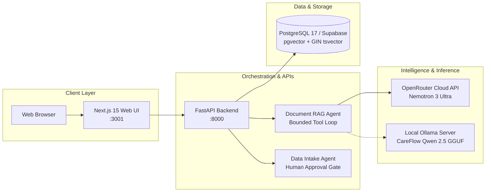

# CareFlow Intelligence

[](https://fastapi.tiangolo.com)
[](https://nextjs.org)
[](https://www.postgresql.org)
[](https://supabase.com)
[](https://github.com/unslothai/unsloth)
[](./LICENSE)

**CareFlow Intelligence** is an enterprise-grade synthetic healthcare operations, clinical knowledge retrieval, and Retrieval-Augmented Fine-Tuning (RAFT) research sandbox. It integrates deterministic clinical data ingestion, bounded agentic RAG workflows, and privacy-preserving local LLM fine-tuning.

---

## 🌟 Key Capabilities

- 🏥 **Synthetic Patient Explorer & Longitudinal Timeline**: Ingests high-fidelity MITRE Synthea™ cohorts (18 clinical tables, CSV & FHIR R4). Visualizes encounters, diagnoses, LOINC lab trends, and medications in a unified, reverse-chronological clinical event stream.
- 🤖 **Agentic Bounded RAG Assistant**: Document RAG Agent powered by OpenRouter Nemotron 3 Ultra (or local Ollama Qwen 2.5) with strict bounded tool execution (`list_documents`, `search_documents`), query reformulation, and mandatory citation validation against PostgreSQL `to_tsvector` GIN indexes.
- 🔬 **Medical Knowledge Ingestion Suite**: Multi-tier background pipelines for streaming FDA package inserts (OpenFDA DailyMed), peer-reviewed biomedical literature (PubMed E-Utilities), clinical practice guidelines (ADA, AHA/ACC, KDIGO), and hospital Grand Rounds media transcripts.
- 🧠 **RAFT (Retrieval-Augmented Fine-Tuning) Pipeline**: Generates training datasets with Oracle ground truth ($D^*$), hard distractors ($D_{distractor}$), and 20% clinical abstention cases ($D_{abs}$). Trains 4-bit QLoRA models via Unsloth/HuggingFace with automated GGUF quantization for zero-cost, private Ollama inference.
- 🛡️ **Strict Healthcare Safety Boundaries**: Isolated synthetic sandbox, non-parametric citation verification, untrusted evidence handling, human-in-the-loop ingestion approval gates, and deterministic extractive fallbacks.

---

## 🏗️ System Architecture



---

## 🚀 Quickstart Guide

### 1. Prerequisites
- [Docker Desktop](https://www.docker.com/) (recommended)
- Python 3.12+ (if running scripts locally)
- Node.js 20+ (if developing frontend locally)

### 2. Configure Environment
```powershell
# Copy environment template
Copy-Item .env.example .env

# (Optional) Add your OPENROUTER_API_KEY in .env for cloud LLM reasoning
```

### 3. Launch Services with Docker Compose
```powershell
docker compose up -d --build
```

- **Frontend Clinical UI**: [http://localhost:3001](http://localhost:3001)
- **FastAPI Interactive Docs (Swagger)**: [http://localhost:8000/docs](http://localhost:8000/docs)
- **Database Status Endpoint**: [http://localhost:8000/api/database/status](http://localhost:8000/api/database/status)

---

## 📖 Comprehensive Documentation Suite

Dive deep into every component of CareFlow Intelligence:

| Document | Topic & Details |
| :--- | :--- |
| [**Architecture & C4 Diagrams**](./docs/ARCHITECTURE.md) | C4 Context, Container, Component, and Sequence diagrams, data flows, and safety boundaries. |
| [**REST API Reference**](./docs/API_REFERENCE.md) | Full endpoint reference, schemas, request/response models, query filters, and error codes. |
| [**Synthetic Data Pipeline**](./docs/DATA_PIPELINE.md) | Synthea generation engine, CSV/FHIR schemas, validation guards, and human-in-the-loop imports. |
| [**Knowledge Ingestion Suite**](./docs/KNOWLEDGE_INGESTION.md) | Ingestion pipelines for OpenFDA monographs, PubMed trials, ADA/AHA/KDIGO guidelines, and media transcripts. |
| [**RAFT & ML Fine-Tuning**](./docs/RAFT_PIPELINE.md) | Dataset synthesis with distractors/abstentions, Unsloth 4-bit QLoRA, benchmarks, and Ollama deployment. |
| [**Frontend & Clinical UI Guide**](./docs/FRONTEND_GUIDE.md) | Next.js 15 App Router structure, Patient Explorer, Unified Timeline, and Agent Trace Inspector. |
| [**Deployment & Operations Runbook**](./docs/DEPLOYMENT_AND_OPERATIONS.md) | Docker orchestration, Supabase Cloud configuration, live log streaming, and troubleshooting runbooks. |
| [**Command Reference Sheet**](./COMMANDS.md) | Ready-to-use copy-paste PowerShell commands for all system workflows. |
| [**Development Iteration Log**](./WALKTHROUGH.md) | Complete iteration history, architectural decisions, and benchmark verification results. |

---

## ⚡ Essential Workflows at a Glance

### Ingest Medical Literature & Guidelines
```powershell
# Ingest Guidelines, FDA Monographs, PubMed Literature & Media
.\.venv\Scripts\python.exe .\scripts\ingest_all.py
```

### Run RAFT Fine-Tuning & Benchmark Suite
```powershell
# 1. Synthesize 50 clinical RAFT QA samples
.\.venv\Scripts\python.exe .\scripts\raft\generate_dataset.py 50

# 2. Run automated benchmark evaluation
.\.venv\Scripts\python.exe .\scripts\raft\evaluate_raft.py

# 3. Fine-tune locally with Unsloth (Fast 4-bit QLoRA)
python .\scripts\raft\train_unsloth_qwen.py --model "unsloth/Qwen2.5-7B-Instruct-bnb-4bit"
```

### Stream Live System Logs
```powershell
# Stream API logs in real-time
docker logs -f careflowintelligence-api-1
```

---

## 🔒 Safety & Compliance Boundary

- **Synthetic Data Only**: All patient records are generated via MITRE Synthea. Real Protected Health Information (PHI) is strictly prohibited.
- **Traceable Ground Truth**: The assistant refuses to answer using parametric memory and strictly requires grounded evidence citations (`[chunk: ID]`).
- **No Autonomous Clinical Decisions**: Designed exclusively for clinical research, operational simulation, and educational exploration.