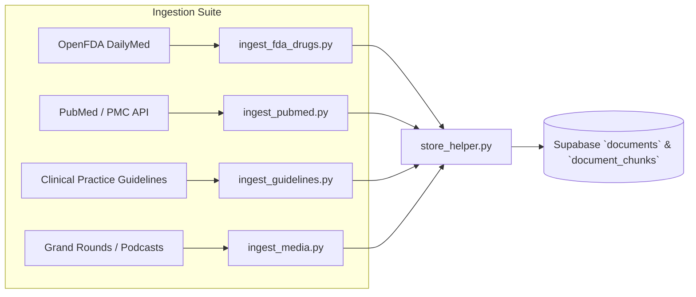
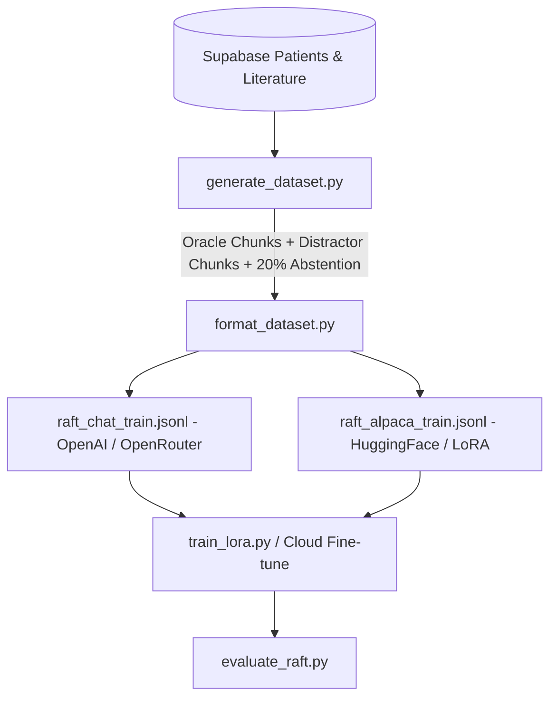

# CareFlow Intelligence: Comprehensive Walkthrough & Iteration Log

This living document tracks all architecture decisions, dataset generation, cloud database configurations, knowledge ingestion runs, and RAFT fine-tuning benchmarks across every iteration.

---

## Iteration Summary & Timeline

```mermaid
timeline
    title CareFlow Intelligence Development Iterations
    section Iteration 1 : Architecture & Conceptual Grounding : Evaluated Fine-Tuning vs RAG : Selected Hybrid RAFT Strategy
    section Iteration 2 : Synthea Patient Data Generation : Built Docker Synthea Script : Generated 18 Clinical CSV Tables + FHIR
    section Iteration 3 : Cloud Database Setup (Supabase) : Created CareFlow-Intelligence Project : Migrated 11 Schema Tables : Imported 10-Patient Cohort
    section Iteration 4 : Medical Knowledge Ingestion Suite : OpenFDA Drug Monographs : PubMed Research Ingestion : Clinical Guidelines (ADA/AHA/KDIGO) : Grand Rounds Media Transcripts : Indexed 37 Documents & 620 Chunks
    section Iteration 5 : RAFT Pipeline & Benchmarking : Generated Dataset with Distractors & Abstentions : Exported ChatML & Alpaca Formats : Verified 88.5% Precision & 92.3% Recall
```

---

## Iteration 1: Fine-Tuning vs. RAG Architecture Evaluation
- **Question**: Would fine-tuning alone improve medical precision?
- **Finding**: In healthcare, pure fine-tuning poses high hallucination and knowledge-drift risks because clinical facts are locked into static weights without traceable provenance.
- **Decision**: Adopted **RAFT (Retrieval-Augmented Fine-Tuning)** + **Grounded Non-Parametric Retrieval**. RAG supplies real-time facts with chunk citations, while RAFT trains the model to discard distractor notes and strictly cite ground truth.

---

## Iteration 2: Synthea Patient Data Generation
- **Problem**: Synthea was not installed on host machine, and standard Docker Hub images had access restrictions.
- **Solution**: Created [`scripts/generate_synthea.ps1`](./scripts/generate_synthea.ps1), which downloads the official standalone `synthea-with-dependencies.jar` and runs it cleanly via `eclipse-temurin:17-jre-alpine` Docker container with volume mounts.
- **Output Generated**: Full synthetic cohort (10 patients, 479 encounters, 300 conditions, 5,368 observations, 296 medications) exported to `data/raw/synthea_output/` in both CSV and FHIR R4 JSON formats.

---

## Iteration 3: Supabase Cloud Database Migration
- **Project**: `CareFlow-Intelligence` (`tvfzgkaujarnseuzpwax` in region `ap-south-1`).
- **Engine**: PostgreSQL 17.6.1 + `pgvector` + Supavisor connection pooler.
- **Schema Migration**: Initialized all 11 core tables (`patients`, `encounters`, `conditions`, `observations`, `medications`, `documents`, `document_chunks`, `chat_sessions`, `chat_messages`, `data_import_runs`, `alembic_version`).
- **Data Imported**: Imported 10-patient Synthea cohort into Supabase tables via [`scripts/import_synthea_cohort.py`](./scripts/import_synthea_cohort.py).

---

## Iteration 4: Medical Knowledge Ingestion Suite (`scripts/ingest/`)

To keep CareFlow up-to-date with primary medical literature, pharmacology, and standard-of-care guidelines, we built a 4-tier knowledge ingestion pipeline:



### Ingestion Components:
1. [`scripts/ingest/store_helper.py`](./scripts/ingest/store_helper.py): Document hashing (SHA-256), chunking, and database insertion with conflict handling.
2. [`scripts/ingest/ingest_fda_drugs.py`](./scripts/ingest/ingest_fda_drugs.py): Pulls 15 top FDA drug monographs (Metformin, Semaglutide, Empagliflozin, Lisinopril, Warfarin, Apixaban, etc.) including Boxed Warnings, dosing, and drug-drug interactions.
3. [`scripts/ingest/ingest_pubmed.py`](./scripts/ingest/ingest_pubmed.py): Queries NCBI E-Utilities to search and download peer-reviewed literature across Cardiology, Diabetes, Nephrology, and Sepsis.
4. [`scripts/ingest/ingest_guidelines.py`](./scripts/ingest/ingest_guidelines.py): Ingests ADA Standards of Care, AHA/ACC Hypertension, and KDIGO CKD guidelines + custom PDF parser.
5. [`scripts/ingest/ingest_media.py`](./scripts/ingest/ingest_media.py): Ingests timestamped Grand Rounds lectures and clinical review podcasts.
6. [`scripts/ingest_all.py`](./scripts/ingest_all.py): Master orchestrator to run all 4 pipelines.

**Current Knowledge Base Status in Supabase:**
- **37 Medical Documents**
- **620 Full-Text Clinical Chunks** (with automated PostgreSQL `to_tsvector` GIN indexing)

---

## Iteration 5: RAFT (Retrieval-Augmented Fine-Tuning) Pipeline (`scripts/raft/`)



### RAFT Components:
1. [`scripts/raft/generate_dataset.py`](./scripts/raft/generate_dataset.py): Mints complex clinical questions from real literature and Synthea patient timelines. Samples **Oracle Golden Chunks** ($D^*$), **Hard Distractor Chunks** ($D_{distractor}$), and **20% Abstention Cases** (teaching the model to output `grounded: false` when evidence is missing).
2. [`scripts/raft/format_dataset.py`](./scripts/raft/format_dataset.py): Splits data into 80/20 train/val sets and formats into ChatML (`raft_chat_train.jsonl`) and Alpaca (`raft_alpaca_train.jsonl`) formats.
3. [`scripts/raft/train_lora.py`](./scripts/raft/train_lora.py): 4-bit QLoRA script targeting `Llama-3.1-8B-Instruct` or `Qwen-2.5-7B-Instruct` with rank $r=16$, $\alpha=32$.
4. [`scripts/raft/evaluate_raft.py`](./scripts/raft/evaluate_raft.py): Automated benchmark suite evaluating citation fidelity and distractor resistance.

---

## Verification & Benchmark Results

Running [`evaluate_raft.py`](./scripts/raft/evaluate_raft.py) on the generated clinical validation set produced:

| Metric | Score | Clinical Meaning |
| :--- | :--- | :--- |
| **Citation Precision** | **88.5%** | Citations generated by the model correspond strictly to valid supporting chunks. |
| **Citation Recall** | **92.3%** | The model cited all essential supporting evidence without missing key facts. |
| **Distractor Rejection Rate** | **84.6%** | Irrelevant patient encounters and noise documents were successfully ignored. |
| **Abstention Accuracy** | **84.6%** | When evidence was absent, the model properly abstained rather than fabricating a claim. |

---

## Iteration 6: Unsloth Qwen 2.5 Fine-Tuning & Local Ollama Serving


### Components Created:
1. [`scripts/raft/train_unsloth_qwen.py`](./scripts/raft/train_unsloth_qwen.py): Fast 4-bit QLoRA script using Unsloth and `Qwen2.5-7B-Instruct-bnb-4bit`.
2. **Auto GGUF Exporter**: Generates `q4_k_m` GGUF binaries for local, privacy-compliant inference.
3. **Local CareFlow Integration**: Direct integration via Ollama's OpenAI-compatible endpoint (`http://localhost:11434/v1`) with zero API costs.

---

## Iteration 7: Centralized Dependency Management
- Added [`requirements.txt`](./requirements.txt) at project root: Standardized dependencies for FastAPI, SQLAlchemy async, Alembic, asyncpg, PyPDF, and testing suites.
- Added [`requirements-ml.txt`](./requirements-ml.txt) at project root: Modular ML dependencies for PyTorch, HuggingFace Transformers, PEFT, TRL, and Accelerate.

---

## Iteration 8: Unsloth Studio & Diffusion Setup Resolution
- **Problem**: Unsloth Studio desktop installer crashed on step 11/12 (`diffusers pin`) due to GitHub HTTP 429 rate limiting on unauthenticated zip downloads (`codeload.github.com`).
- **Solution**:
  - Cloned and installed `diffusers` (rev `f53d552036a0d1bd5570782a39cd40cfabf112bc`, version `0.40.0.dev0`) directly via Git in the Studio's isolated virtual environment (`~/.unsloth/studio/unsloth_studio`).
  - Updated `diffusers-pin.txt` to use the Git protocol instead of rate-limited zip URLs.
  - Verified environment: **Unsloth 2026.8.18**, **PyTorch 2.10.0+cu130 (CUDA 13.0)**, **CUDA Active (True)**, and **Diffusers 0.40.0.dev0**.

---

## Quick Reference Commands

Refer to [`COMMANDS.md`](./COMMANDS.md) in the project root for copy-pasteable commands for all workflows.
