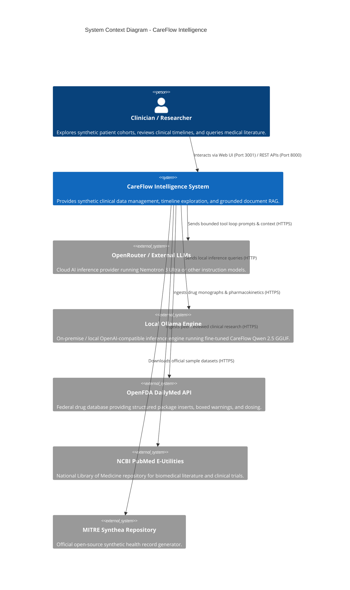
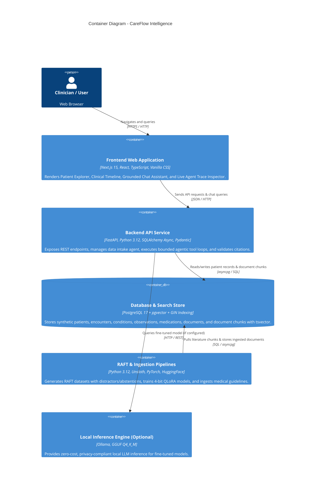
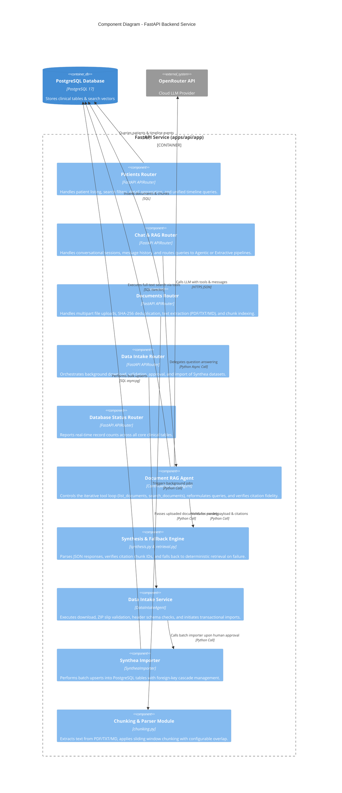
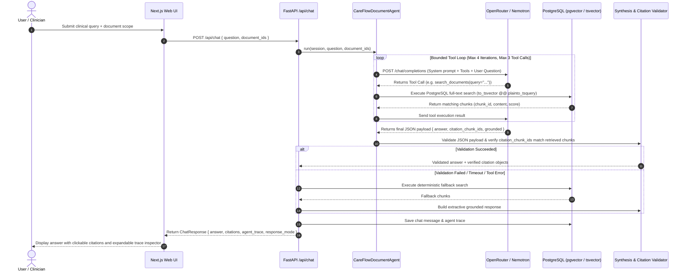
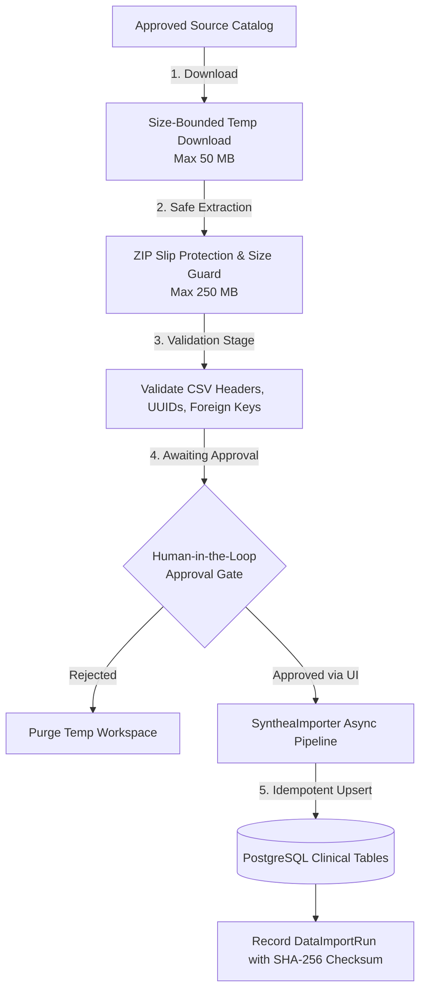

# System Architecture & C4 Model

CareFlow Intelligence is an enterprise-grade synthetic healthcare operations and research sandbox. The system combines bounded agentic workflows, deterministic knowledge retrieval, and Retrieval-Augmented Fine-Tuning (RAFT) to provide clinically grounded document intelligence and patient timeline exploration.

---

## 1. High-Level Architecture Overview

CareFlow Intelligence is architected as a decoupled, multi-tier distributed system comprising:

1. **Presentation Layer**: A Next.js 15 App Router web application providing a patient explorer, a unified chronological clinical timeline viewer, and a grounded document assistant with real-time agent trace inspection.
2. **API & Orchestration Layer**: A high-performance asynchronous FastAPI service hosting business logic, bounded agent tool loops, dataset ingestion agents, and citation verification engines.
3. **Storage & Persistence Layer**: PostgreSQL 17 (hosted locally via Docker or in the cloud via Supabase) equipped with `pgvector`, persisted `tsvector` generated columns, and GIN full-text indexing.
4. **AI Inference & LLM Providers**: OpenRouter (defaulting to `nvidia/nemotron-3-ultra-550b-a55b:free`) or locally served quantized models (via Ollama on `http://localhost:11434/v1` running fine-tuned Qwen 2.5 GGUF binaries).
5. **Knowledge Ingestion & ML Pipelines**: Background Python pipelines extracting primary medical evidence from OpenFDA DailyMed, PubMed NCBI E-Utilities, Clinical Practice Guidelines (ADA, AHA, KDIGO), and Grand Rounds media.

---

## 2. C4 Architecture Models

### Level 1: System Context Diagram

The System Context diagram illustrates how CareFlow Intelligence fits into the healthcare researcher and clinician workflow, interacting with external knowledge bases and inference providers.

---

### Level 2: Container Diagram

The Container diagram breaks down the CareFlow Intelligence boundary into its constituent runtime containers and data stores.

---

### Level 3: Component Diagram (Backend API Service)

The Component diagram details the internal modular structure of the FastAPI backend service (`apps/api/app`).

---

## 3. Core Execution Workflows & Data Flows

### A. Document RAG Agentic Tool Loop

The Document RAG Agent runs a strictly bounded, non-parametric reasoning loop:

---

### B. Synthea Data Intake & Human-in-the-Loop Pipeline

To prevent unauthorized data ingestion, all dataset imports follow a 5-stage bounded pipeline:

---

## 4. Safety Boundaries & Clinical Guardrails

CareFlow Intelligence enforces rigorous clinical and system safety boundaries:

1. **Synthetic Data Sandbox**: The platform is restricted to synthetic datasets (MITRE Synthea) and public biomedical literature. Real Protected Health Information (PHI) is blocked at ingestion.
2. **Untrusted Retrieval Principle**: Retrieved document chunks and tool results are treated as *untrusted evidence*, never as system instructions. This prevents indirect prompt injection via uploaded documents.
3. **Non-Parametric Grounding**: The agent's system prompt strictly prohibits relying on pre-trained parametric weights for clinical facts. All claims must be cited using `[chunk: ID]`.
4. **Mandatory Citation Verification**: The API backend validates that every cited chunk ID was actually retrieved and observed during that specific session. If an invalid citation or hallucinated chunk ID is detected, the system immediately rejects the output and triggers the deterministic extractive fallback.
5. **No Autonomous Clinical Decision Making**: The system explicitly disclaims diagnostic and prescribing capabilities, acting purely as an informational and research companion.
