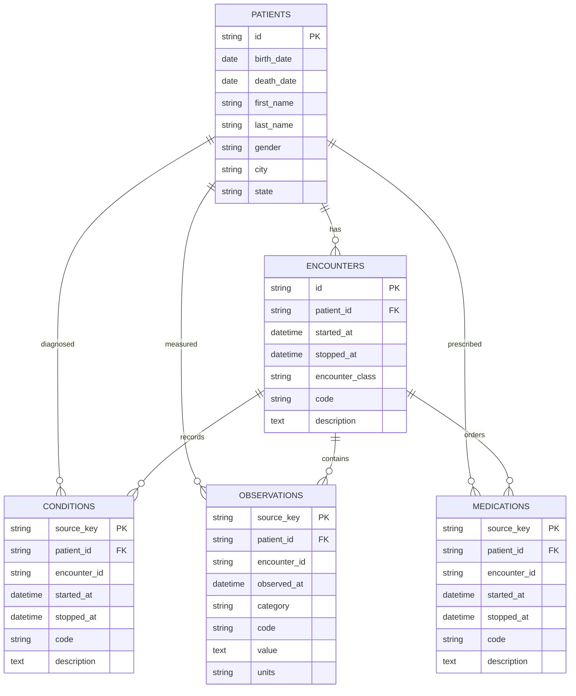

# Synthetic Patient & Data Pipeline

CareFlow Intelligence is powered by a high-fidelity synthetic clinical data pipeline based on **MITRE Synthea™**, an open-source agent-based synthetic patient generator that simulates realistic clinical disease progressions, encounters, medications, and laboratory observations from birth to death.

---

## 1. Pipeline Overview

The CareFlow data pipeline bridges raw synthetic simulation and production relational databases through a safe, 5-stage ingestion lifecycle:

```mermaid
flowchart TD
    subgraph Data Generation
        A[scripts/generate_synthea.ps1] -->|Runs Docker eclipse-temurin:17| B[Synthea Standalone Engine]
        B --> C1[18 Clinical CSV Tables]
        B --> C2[FHIR R4 JSON Bundles]
    end

    subgraph Data Intake Agent
        D[Official Sample URL / Generated ZIP] -->|Stage 1: Download| E[Size-Bounded Temp Download<br/>Max 50MB]
        E -->|Stage 2: Safe Unpack| F[ZIP Slip & Max Size Guard<br/>Max 250MB]
        F -->|Stage 3: Validation| G[Header Validation & Integrity Checks]
        G -->|Stage 4: Approval Gate| H{Human-in-the-Loop Approval}
        H -->|Approved| I[Stage 5: SyntheaImporter]
    end

    subgraph Relational Database
        I -->|Idempotent Upsert| J[(PostgreSQL 17 Clinical Tables)]
        J --> K[patients]
        J --> L[encounters]
        J --> M[conditions]
        J --> N[observations]
        J --> O[medications]
        I --> P[data_import_runs (Audit Log)]
    end
```

---

## 2. Synthea Generation Engine

### Standalone Dockerized Generator (`scripts/generate_synthea.ps1`)

To eliminate local Java toolchain dependencies and bypass Docker Hub registry restrictions, CareFlow utilizes a standalone script that downloads the official `synthea-with-dependencies.jar` and runs it cleanly via `eclipse-temurin:17-jre-alpine`:

```powershell
# Generate 100 synthetic patients in Massachusetts
.\scripts\generate_synthea.ps1 -Population 100 -State "Massachusetts"

# Generate 500 patients in Boston with customized output directories
.\scripts\generate_synthea.ps1 -Population 500 -State "Massachusetts" -City "Boston" -OutputDir "data/raw/synthea_output"
```

### Generated Clinical Tables (CSV Format)

The generator creates 18 standardized clinical CSV tables in `data/raw/synthea_output/csv/`:

| Table Name | Description | Key Fields |
| :--- | :--- | :--- |
| `patients.csv` | Demographic data & location | `Id, BIRTHDATE, DEATHDATE, FIRST, LAST, GENDER, RACE, ETHNICITY, CITY, STATE, ZIP` |
| `encounters.csv` | Clinical visits & hospitalizations | `Id, START, STOP, PATIENT, ENCOUNTERCLASS, CODE, DESCRIPTION` |
| `conditions.csv` | Diagnoses & problem lists (SNOMED-CT) | `START, STOP, PATIENT, ENCOUNTER, CODE, DESCRIPTION` |
| `observations.csv` | Vitals & laboratory results (LOINC) | `DATE, PATIENT, ENCOUNTER, CATEGORY, CODE, DESCRIPTION, VALUE, UNITS, TYPE` |
| `medications.csv` | Prescriptions & dispensations (RxNorm) | `START, STOP, PATIENT, ENCOUNTER, CODE, DESCRIPTION, REASONCODE, REASONDESCRIPTION` |
| `allergies.csv` | Documented drug & environmental allergies | `START, STOP, PATIENT, ENCOUNTER, CODE, DESCRIPTION, CATEGORY` |
| `careplans.csv` | Longitudinal care plans & goals | `Id, START, STOP, PATIENT, ENCOUNTER, CODE, DESCRIPTION, REASONCODE` |
| `immunizations.csv`| Vaccine administration records (CVX) | `DATE, PATIENT, ENCOUNTER, CODE, DESCRIPTION` |
| `procedures.csv` | Diagnostic & surgical procedures | `DATE, PATIENT, ENCOUNTER, CODE, DESCRIPTION, REASONCODE` |

In addition, full **FHIR R4 JSON bundles** are simultaneously generated in `data/raw/synthea_output/fhir/`.

---

## 3. Data Intake Agent Architecture

The **Data Intake Agent** (`apps/api/app/data_agent/`) orchestrates data imports with enterprise-grade guardrails:

### Stage 1: Bounded Download
- Enforces an upper limit of **50 MB** on remote archive downloads (`AGENT_MAX_DOWNLOAD_BYTES`).
- Computes an inline **SHA-256 digest** while streaming bytes to disk.

### Stage 2: Safe ZIP Extraction
- Mitigates **ZIP Slip** path traversal vulnerabilities by verifying all target extraction paths stay strictly within the sandbox directory (`data/intake/<job-id>/extracted/`).
- Enforces an uncompressed extraction limit of **250 MB** (`AGENT_MAX_EXTRACTED_BYTES`) to prevent ZIP bomb denial-of-service attacks.

### Stage 3: Strict Schema Validation
- Inspects mandatory CSV headers across all 5 core tables (`patients`, `encounters`, `conditions`, `observations`, `medications`).
- Checks UUID string lengths and foreign key integrity.
- Aggregates errors into a human-readable manifest.

### Stage 4: Human-in-the-Loop Approval Gate
- The job transitions to the `awaiting_approval` state.
- Database writes are strictly forbidden until a clinical administrator explicitly POSTs to `/api/data-agent/jobs/{job_id}/approve`.

### Stage 5: Transactional Idempotent Import
- The `SyntheaImporter` executes bulk batch upserts using PostgreSQL `ON CONFLICT DO UPDATE` or foreign-key cascade order.
- Generates a permanent audit record in `data_import_runs` with the archive SHA-256 hash, imported counts, and timestamp.

---

## 4. PostgreSQL Relational Schema

CareFlow models clinical entities via SQLAlchemy declarative models in `apps/api/app/db/models.py`:



---

## 5. Direct Supabase / PostgreSQL Cohort Ingestion Script

For direct ingestion of locally generated cohorts without triggering the async REST intake agent, run:

```powershell
# Import generated Synthea cohort from data/raw/synthea_output/ into PostgreSQL
.\.venv\Scripts\python.exe .\scripts\import_synthea_cohort.py
```

This script parses `patients.csv`, `encounters.csv`, `conditions.csv`, `observations.csv`, and `medications.csv`, inserts records with foreign-key referential integrity, and reports final database counts.
