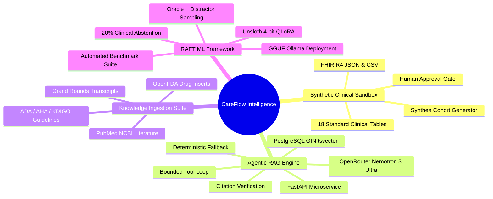

# CareFlow Intelligence Documentation

Welcome to the comprehensive technical documentation for **CareFlow Intelligence**, an enterprise-grade synthetic healthcare operations, clinical knowledge retrieval, and Retrieval-Augmented Fine-Tuning (RAFT) research platform.

---

## 📚 Documentation Table of Contents

| Document | Description | Target Audience |
| :--- | :--- | :--- |
| [**System Architecture & C4 Model**](file:///c:/Users/naman/OneDrive/Desktop/CareFlow%20Intelligence/docs/ARCHITECTURE.md) | Comprehensive architecture overview, C4 Context, Container, Component, and Code diagrams, sequence flows, and safety boundaries. | Architects, Engineers, Security Leads |
| [**API Reference Guide**](file:///c:/Users/naman/OneDrive/Desktop/CareFlow%20Intelligence/docs/API_REFERENCE.md) | Exhaustive REST API specification covering Patient APIs, Unified Timeline, Agentic RAG Chat, Document Ingestion, and Data Intake. | Backend Developers, Integrators |
| [**Synthetic Patient & Data Pipeline**](file:///c:/Users/naman/OneDrive/Desktop/CareFlow%20Intelligence/docs/DATA_PIPELINE.md) | End-to-end Synthea data generation, validation stages, human-in-the-loop approval, and idempotent database ingestion. | Data Engineers, ML Engineers |
| [**Medical Knowledge Ingestion Suite**](file:///c:/Users/naman/OneDrive/Desktop/CareFlow%20Intelligence/docs/KNOWLEDGE_INGESTION.md) | Ingestion pipelines for OpenFDA monographs, PubMed literature, clinical practice guidelines (ADA/AHA/KDIGO), and Grand Rounds media. | ML Engineers, Clinical Informaticists |
| [**RAFT & ML Fine-Tuning Framework**](file:///c:/Users/naman/OneDrive/Desktop/CareFlow%20Intelligence/docs/RAFT_PIPELINE.md) | Retrieval-Augmented Fine-Tuning (RAFT), dataset synthesis with distractors & abstentions, Unsloth QLoRA training, benchmarks, and Ollama deployment. | ML Engineers, AI Researchers |
| [**Frontend & Clinical UI Guide**](file:///c:/Users/naman/OneDrive/Desktop/CareFlow%20Intelligence/docs/FRONTEND_GUIDE.md) | Next.js 15 App Router architecture, Patient Explorer, Chronological Timeline, Grounded Assistant, and Agent Trace Inspector. | Frontend Developers, UX Designers |
| [**Deployment & Operations Runbook**](file:///c:/Users/naman/OneDrive/Desktop/CareFlow%20Intelligence/docs/DEPLOYMENT_AND_OPERATIONS.md) | Docker Compose orchestration, Supabase Cloud configuration, environment variables, monitoring, log inspection, and troubleshooting. | DevOps, SREs, System Admins |

---

## 🎯 Platform Highlights

---

## 🚀 Quick Navigation

- **Start developing locally**: See the [Deployment & Operations Guide](file:///c:/Users/naman/OneDrive/Desktop/CareFlow%20Intelligence/docs/DEPLOYMENT_AND_OPERATIONS.md).
- **Explore the API endpoints**: Review the [API Reference](file:///c:/Users/naman/OneDrive/Desktop/CareFlow%20Intelligence/docs/API_REFERENCE.md).
- **Understand how fine-tuning works**: Read the [RAFT Pipeline Documentation](file:///c:/Users/naman/OneDrive/Desktop/CareFlow%20Intelligence/docs/RAFT_PIPELINE.md).
- **Run copy-paste commands**: Check [COMMANDS.md](file:///c:/Users/naman/OneDrive/Desktop/CareFlow%20Intelligence/COMMANDS.md).
- **Review historical project iterations**: Check [WALKTHROUGH.md](file:///c:/Users/naman/OneDrive/Desktop/CareFlow%20Intelligence/WALKTHROUGH.md).
